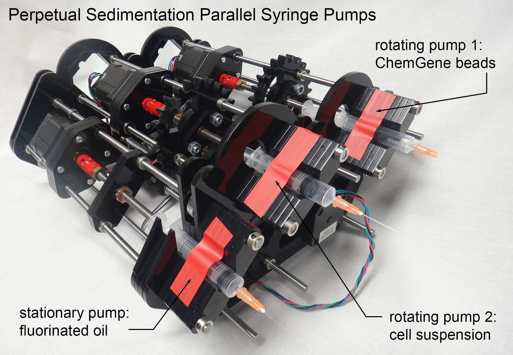
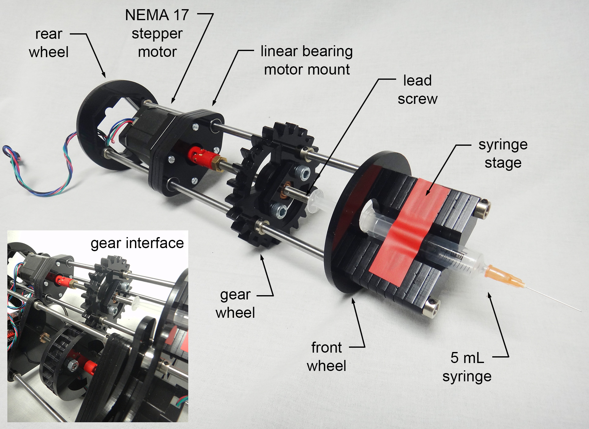
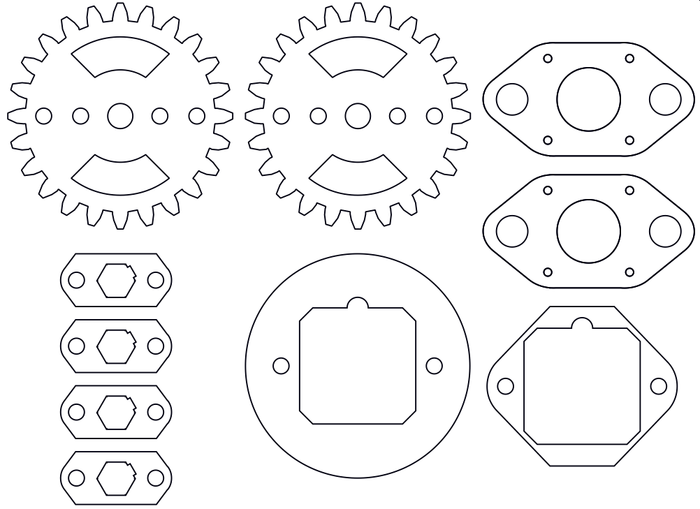
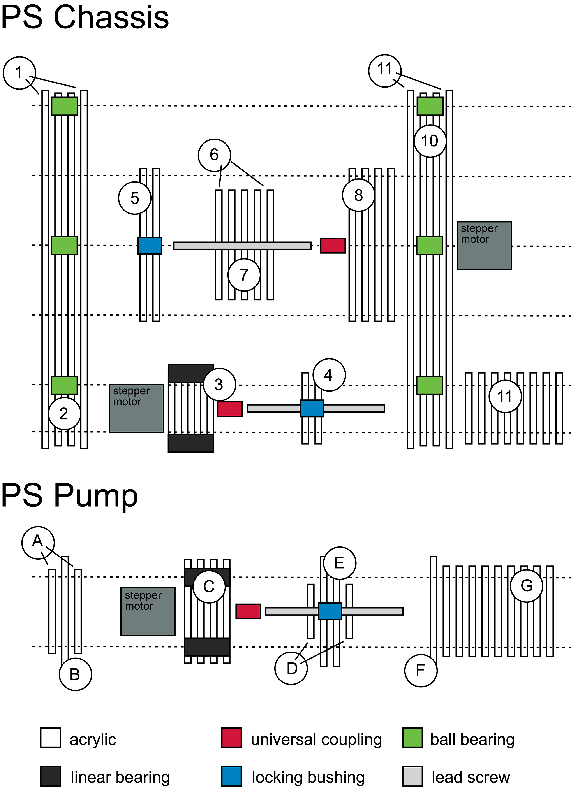
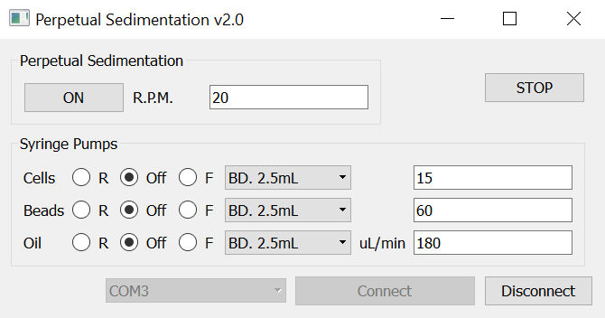

# Perpetual Sedimentation Syringe Pumps for Drop-Seq

**This page describes how to build rotating syringe pumps suitable for Drop-seq microfluidics and many other applications.**

The original source code is provided under MIT License. The designs, documentation and operating code in this repository is Copyright© 2019 Jonathan West and Simon Lane, Perpetual Sedimentation contributors under a Creative Commons Attribution 4.0 International (CC BY 4.0) License.

## Introduction

Many microfluidic applications involve the use of particulates, typically beads or cells. These are prone to sediment scaling with R2 (radius) and density dissimilarity to the carrier medium. This results in progressively reduced delivery to the microfluidic device impacting throughput and causing other deleterious effects. Magnetic stirring is conventionally used to address this, but damages fragile cells and beads such as the brittle ChemGene beads central to Drop-seq single cell transcriptome analysis. Magnetic stirring is also not feasible for samples housed in small syringes or for use with magnetic particles.
To solve this problem we have innovated the original inexpensive, high-performance DropletKitchen syringe pumps by mounting them on a rotating gear wheel. Fluid rotation coupled with sedimentation causes the particles to describe an orbit, retaining them in a suspended state in the syringe throughout the microfluidic procedure. Here we provide designs, documentation and driving code for a perpetual sedimentation syringe pump system suitable for Drop-seq microfluidics. The system is inexpensive (<£400), lightweight (4.45 kg) and compact (333 x 277 x 155 mm; l x d x h). The system comprises 3 high performance syringe pumps, 2 of which rotate 360° and then reverse (to avoid cable and tubing entanglement) to enable perpetual sedimentation for the continuous delivery of particulates. This open instrumentation approach involves laser cutting acrylic sheets to rapidly provide sturdy parts for mounting on a steel rod chassis. The Drop-seq Perpetual Sedimentation prototype is shown in Figure 1 and a single rotating pump shown in Figure 2. Motors, driving electronics and other assembly components are commercially available, with the system completed using an Arduino operating code controlled via a streamlined GUI.

 

Figure 1. A parallel syringe pump perpetual sedimentation prototype supporting two rotating syringe pumps and a third static syringe pump.

 

Figure 2. A rotating syringe pump with an image of the gear interface (inset).

## Design Files

The design file for laser cutting all acrylic components can be found here (LINK); some CAD parts are shown in Figure 3. 

 

Figure 3. Design file of parts for a rotating pump.

To assemble the chassis and the pump in the correct sequence an alphanumeric scheme is used to label the parts with the salami arrangements shown in Figure 4. Ensure the labels are not hairlines before cutting.

 

Figure 4. Assembly instructions for the perpetual sedimentation chassis and a rotating pump. The dashed lines represent the steel rods. Zinc collets (not shown) are used to secure the acrylic parts in place.

## Electronics

Inexpensive, yet high-performance hobbyist components were chosen for straightforward assembly and reliable operation: An Arduino MEGA2560 microcontroller was used with a RAMPS 1.4 shield (ooznest.co.uk) to interface with four DRV8825 stepper motor drivers, one for each pump and the fourth to drive the central gear wheel. Power was supplied from a standard 12V 5A supply (RS online). Each stepper motor was limited to 1.2A by adjusting the potentiometer of the DRV8825. Microstepping at 1/8 step for the gear motor and 1/16 step for the syringe pumps was achieved by connecting (high) or disconnecting (low) the microstep selection pins (found beneath each stepper motor driver) as described in the following table. 

MODE0 | MODE1 | MODE2 | Microstep Resolution | 
---|---|---|---
Low | Low | Low | Full Step
High | Low | Low | Half Step
Low | High | Low | 1/4 Step
High | High | Low | 1/8 Step
Low | Low | High | 1/16 Step
High | Low | High | 1/32 Step
Low | High | High | 1/32 Step
High | High | High | 1/32 Step

## Control Software
## Arduino

The Arduino was flashed with a simple program (PS1.0.ino) capable of receiving commands over the USB connection in a standard format. These commands can be sent to the Arduino from the Arduino IDE, from any suitable scripting language (baud rate of 115200) or from the GUI we provide (python source: PS2.0.py; ). The list of accepted commands with brief descriptions follows:

Command | Use | Notes 
---|---|---
/af.xxx; | Pump A, forwards direction | xxx is the rpm x 100
/ar.xxx; | Pump A, reverse direction | xxx is the rpm x 100
/aoff; | Pump A off | 
/bf.xxx; | Pump B, forwards direction | xxx is the rpm x 100
/br.xxx; | Pump B, reverse direction | xxx is the rpm x 100
/boff; | Pump B off | 
/cf.xxx; | Pump C, forwards direction | xxx is the rpm x 100
/cr.xxx; | Pump C, reverse direction | xxx is the rpm x 100

/coff; | Pump C off | 
/on.xxx; | Rotation of pumps B and C | xxx is the rpm 
/off; | Stop rotation of pumps B and C | 
/hello; | For testing connection to Arduino | Arduino responds “Hi there”
/stop; | Stops all pumps and rotation |  

## GUI

For convenience we provide a streamlined graphical user interface (see Figure 5) that allows easier interaction with the perpetual sedimentation device. Six common syringe sizes are stored in the software such that the user can select pump output in the more meaningful µL/min form rather than rpm. The control software can be found  , and the source code .

 

Figure 5. Streamlined GUI for operating a 3-pump perpetual sedimentation system.

## Equipment/Other Materials

Laser cutter (we used an Epilog Mini, 60W)
Soldering iron
Hand tools (screwdrivers, Allen keys, wire strippers)
Sugru to insulate connections and acrylic weld cement (e.g. WC105 from Bondrite Adhesives) for constructing the electronics tray.
Araldite for securing the universal couplings.

## Bill of Materials

This list is for a parallel perpetual sedimentation system, originally designed for Drop-seq microfluidics with 2 rotating pumps (for beads and cells) and a third static pump (for carrier oil). Component prices are accurate at the time of publication (August 2019).

Component| Number | Purpose | Supplier | Part No. | Price (GBP)
---|---|---|---|---|---
RAMPS 1.4 controller board; with Arduino MEGA2560 | 1 | system control | Ooznest | SKU: RAMPS-S-MEGA2560 | 29.00
DRV8825 stepper motor driver | 4 | individual motor control | Ooznest | SKU: D-DRV8825 | 5.75
NEMA17 stepper motor | 4 | actuate syringes and gear wheel | Ooznest | 1704HS168A | 15.95
USB cable A male to B male 50 cm | 1 | controller to computer interface | Rapid Electronics | 75-0552 | 1.86
5-mm-thick acrylic sheet (410x280 mm) | 9 | chassis | Techsoft | TCAC-R5-COL | 5.35 
silver steel rods 6 mm x 333 mm | 11 | chassis | Technobots | 4426-006 | 2.57
metal shielded deep Groove Ball Bearing 8x22x7 mm | 6 | pump roller | Simply Bearings | 608-ZZ-EU | 2.39
locking phosphor-bronze bushing with Nut 1/4”-80, L=0.50” | 4 | lead screw guide | Thorlabs | N80L6P | 7.61
fine hex adjuster, 1/4"-80, 4" Long | 4 | lead screw | Thorlabs | F25SS400 | 10.18
universal coupling insert - 1/4" | 4 | motor coupling | Technobots | 4604-066 | 2.69
universal coupling body - 1/4" | 4 | motor coupling | Technobots | 4604-050 | 3.65
linear bearing LM6UU 6 mm bushing | 6 | slides motor | Technobots | 4604-606 | 1.32
zinc collets 6mm pk/4 | 16 | secure parts | hardware store | N/A | 0.20
M3 25 mm screws pk/100 | 1 | to mount motors | Technobots | 4300-006 | 1.54
2.54 mm 36-way socket | 1 | board to motor connection | RS Components | 549-0026 | 4.51
10 way unscreened flat ribbon cable | 1 | board to motor connection | RS Components | 214-0661 | 17.50
12V 5A AC-DC switch mode power supply | 1 | power supply | CPC-Farnell | W02712 | 20.76
---|---|---|---| TOTAL | 383.97

## Suppliers:

Ooznest:			https://ooznest.co.uk/ 
Rapid Electronics:		https://www.rapidonline.com/
TechSoft:			https://www.techsoft.co.uk/
Technobots:			https://www.technobotsonline.com/
Simply Bearings:		https://simplybearings.co.uk/
Thorlabs:			https://www.thorlabs.com/
RS Components:			https://uk.rs-online.com/
CPC-Farnell:			https://cpc.farnell.com/
Bondrite Adhesives:		https://www.bondrite.co.uk/

